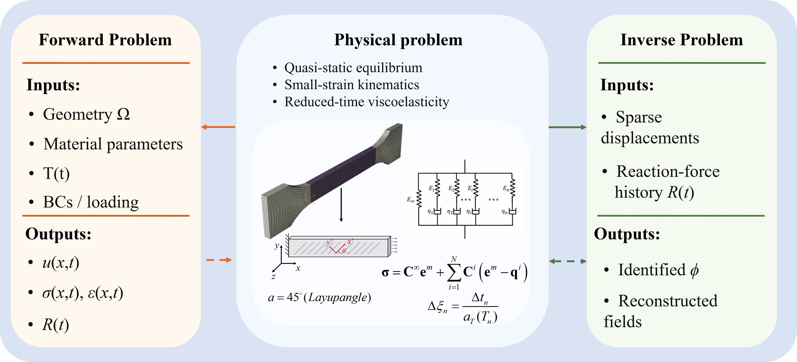

# Physics-informed learning for forward reconstruction and inverse identification of thermo-viscoelastic shape memory polymer composites

## Authors
Wang Haobo, Harbin Institute of Technology (HIT), Harbin, China, wanghaobohit@163.com

## Overview
This repository contains the code accompanying the paper:

**Physics-informed learning for forward reconstruction and inverse identification of thermo-viscoelastic shape memory polymer compositess**

The work focuses on a mechanics problem: identifying thermo-viscoelastic constitutive parameters of SMPCs under history-dependent thermo-mechanical loading, with emphasis on physical consistency, parameter observability, and robustness across random seeds.

## Mechanical Problem Statement
Shape memory polymer composites exhibit strong coupling among:
- viscoelastic time history effects,
- temperature-dependent shift behavior,
- boundary reaction-force response under constrained loading.

The central task is inverse constitutive identification from limited observations while preserving consistency with governing thermo-mechanical behavior.

## Method
The framework uses physics-informed neural networks (PINNs) for:
- forward reconstruction of spatiotemporal response fields,
- inverse recovery of constitutive parameters.

Two temporal formulations are provided:
- PINN (standard spatiotemporal backbone),
- LSTM-PINN (sequence-aware temporal backbone).

Reaction-force supervision (RF) is included as a key observable to improve identifiability of thermal-shift-related parameters.

## Benchmark Examples (EX1–EX4)
- **EX1**: Forward analysis of a non-isothermal shape-memory cycle.
- **EX2**: Inverse identification under isothermal stress-relaxation loading.
- **EX3**: Forward reconstruction in a heterogeneous stress/strain field case.
- **EX4**: Inverse identification under non-isothermal loading with multi-seed RF/noRF evaluation.

## Repository Structure
- `EX1/` - forward benchmark scripts and data.
- `EX2/` - isothermal inverse benchmark and analysis.
- `EX3/` - heterogeneous forward benchmark.
- `EX4/` - non-isothermal inverse benchmark, multi-seed evaluation, and figure scripts.
- `requirements.txt` - Python dependency list.
- `datasavebystep.py` - utility script for step-wise data export/organization.
- `umat.for` - Fortran source related to constitutive/UMAT-side implementation.
- `materialtable.txt` - material parameter table used by the constitutive setup.

