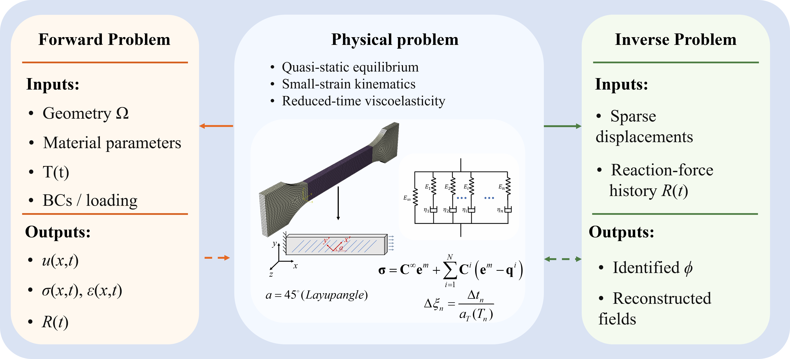

# Reduced-Time Recursive PINN for Thermo-Viscoelastic SMPCs

**Author:** Haobo Wang, Harbin Institute of Technology (HIT)  
**Email:** wanghaobohit@163.com

## Overview

This repository provides the implementation and numerical benchmarks of a **Reduced-Time Recursive Physics-Informed Neural Network (RT-RPINN)** for thermo-viscoelastic shape memory polymer composites (SMPCs).

RT-RPINN separates instantaneous structural-field approximation from constitutive-memory evolution. A differentiable generalized-Maxwell recursion propagates internal states in temperature-dependent reduced material time, incorporating anisotropic stiffness, thermal expansion, and WLF/Arrhenius time–temperature shifting.

The framework supports displacement-based and first-order mixed-field formulations for forward reconstruction and inverse constitutive identification.

## Method

The framework combines:

- **Neural field representation:** Approximation of displacement or mixed displacement–strain–stress fields.
- **Recursive constitutive evolution:** Causal Maxwell-state transfer with linear temporal history-evaluation complexity.
- **Reduced material time:** Temperature-dependent constitutive evolution under non-isothermal loading.
- **Physics-informed learning:** Mechanical equilibrium, kinematic compatibility, constitutive consistency, and boundary constraints.
- **Inverse identification:** Recovery of selected constitutive parameters from sparse structural observations, with loading-path-dependent identifiability analysis.

## Benchmark Examples

| Example | Description |
|---|---|
| **EX1** | Hereditary state transfer and no-state ablation in a tapered specimen. |
| **EX2** | Heterogeneous field reconstruction with 1-, 3-, and 6-branch Maxwell spectra. |
| **EX3** | Non-isothermal constitutive evolution and reduced-time verification. |
| **EX4** | Full-cycle anisotropic SMPC programming, fixation, and recovery. |
| **EX5** | Sparse spatiotemporal reconstruction of a perforated SMPC plate. |
| **EX6** | Bending-dominated displacement and curvature reconstruction under large rotations. |
| **EX7** | Prior-regularized isothermal identification of stiffness and relaxation parameters. |
| **EX8** | Non-isothermal WLF/Arrhenius parameter identifiability and loading-path sensitivity. |

The benchmarks cover constitutive-state accuracy, relaxation behavior, heterogeneous field reconstruction, shape-memory recovery, computational efficiency, parameter identification, and noise robustness.

## Repository Files

- `requirements.txt` — Python dependencies.
- `datasavebystep.py` — Simulation data export utility.
- `umat.for` — Fortran constitutive implementation.
- `materialtable.txt` — Material parameters.
- `Overview.png` — Framework illustration.

## Notes

Reference responses are generated using finite-element and constitutive simulations. The constitutive formulation adopts small-strain generalized-Maxwell mechanics; EX6 separately assesses displacement-field reconstruction under large-rotation kinematics.
